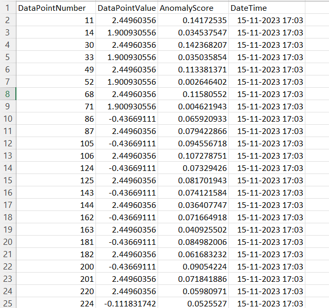

# Efficient Data Stream Anomaly Detection

Author: Nikita (22AG63R07)                                             
email- nikitathakur9938@gmail.com                            
Institution: IIT Kharagpur, Kharagpur

## Overview

This Python-based project utilizes "Isolation Forest" and "ADWIN" (Adaptive Windowing) enhanced by the "river" library, to detect anomalies in continuous data streams. It emphasizes real-time visualization for comprehensive analysis, especially targeting concept drift detection and adaptation.

## Selection of Algorithm 

The chosen algorithm, "Isolation Forest" implemented using Python, collaborates with the river library, focusing on concept drift detection in streaming data. This combination allows real-time anomaly detection while dynamically adapting to changing data patterns and concept drift scenarios, ensuring a robust anomaly detection system.

## strength of Isolation Forest Algorithm:

- **Efficient Isolation**: Isolation Forest algorithm creates random splits in the dataset, efficiently isolating anomalies by requiring fewer splits for outliers, distinguishing them rapidly.

- **Adaptability**: Its effectiveness extends to high-dimensional datasets without assuming specific data distributions, making it versatile and adaptable to diverse data types and patterns.

- **Swift Anomaly Detection**: The algorithm's quick identification of anomalies, regardless of data complexity, ensures rapid and reliable anomaly detection, critical for real-time applications.

- **Less Sensitive to Noise**: It is less sensitive to noisy data since it identifies anomalies by isolating them rather than modeling the entire dataset.

- **Scalability**: Isolation Forest works well on large datasets due to its computational efficiency, making it a good choice for processing big data.

## Features:
- Real-time anomaly detection in continuous streams using Isolation Forest 
- Data generation employs sine wave functions with added random noise
- Dynamic response to changing data patterns, facilitated by the river library through the ADWIN algorithm (Adaptive Windowing)
- Clear visualizations for comprehensive analysis

## Installation:
1. Clone the repository:
git clone https://github.com/gienee/Anomaly_Detection_Project.git
2. Install the required dependencies:
pip install -r requirements.txt
3. Run this python project:
python main.py

## Usages:
Execute the main script, "main.py", to initiate the visualization for anomaly detection.

Figure_1 shows the running anomaly detection of Data Stream

  Fig_2 shows the anomaly data points in the csv format in result folder

## Folder Structure

- **Components/**: contains essential scripts or modules
    - **anomaly_detection.py**
    - **config_parser.py** 
    - **logger.py** 
    - **utils.py** 
- **results/**: Save detected anomalies files
- **requirements.txt**: Document detailing necessary Python dependencies
- **main.py** 
- **Config.ini**: extracting necessary parameters

## Code insights:

- **anomaly_detection.py**: contains the implementation of Isolation Forest algorithms to detect anomalies in a given dataset or data stream, using the python class "Isolation_Forest_Anomaly_Detection"
- **config_parser.py**: contain the code responsible for parsing configuration files using "parseconfig" function, used for extracting necessary parameters 
- **logger.py**: contains code related to logging functionality manages logs, handles logging configurations using function "initialize_custom_logger"
- **utils.py**: contains the "data_stream_generate function" used to generating the data stream with anomalies, seasonal variation and random noise 
- **main.py**: manages the execution flow of the Python project

## Contribution Guideline:
Your contributions matter! Don't hesitate to open issues or send pull requests for enhancements and bug fixes.

## License
This project is licensed under the "Apache License Version 2.0".

