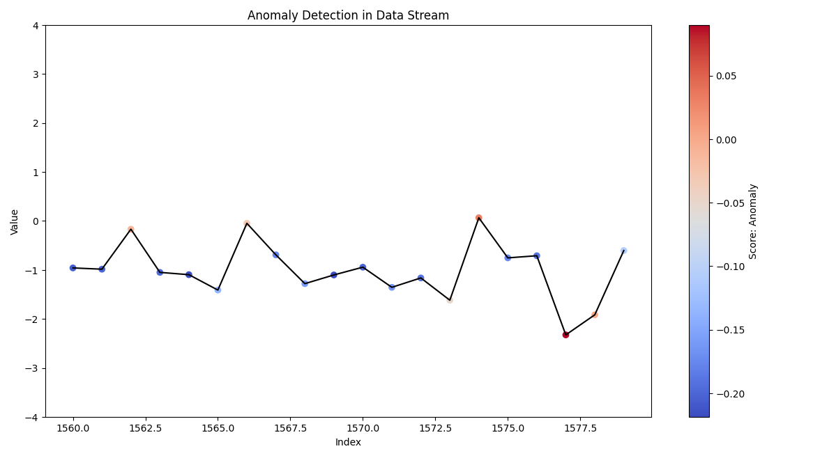

#### ***Detecting Anomalies in Data Streams: Harnessing the Isolation Forest Algorithm**

Author: Nikita                                   ID: 22AG63R07 
email- nikitathakur9938@gmail.com                Institution: IIT Kharagpur, Kharagpur

## Overview
This Python-based project utilizes Isolation Forest and ADWIN, enhanced by the river library, to detect anomalies in continuous data streams. It emphasizes real-time visualization for comprehensive analysis, especially targeting concept drift detection and adaptation.

## Isolation Forest Algorithm strength:
• Efficient Isolation: Isolation Forest algorithm creates random splits in the dataset, efficiently isolating anomalies by requiring fewer splits for outliers, distinguishing them rapidly. 

• Adaptability: Its effectiveness extends to high-dimensional datasets without assuming specific data distributions, making it versatile and adaptable to diverse data types and patterns. 

• Swift Anomaly Detection: The algorithm's quick identification of anomalies, regardless of data complexity, ensures rapid and reliable anomaly detection, critical for real-time applications. 

• Less Sensitive to Noise: It is less sensitive to noisy data since it identifies anomalies by isolating them rather than modeling the entire dataset.  

• Scalability: Isolation Forest works well on large datasets due to its computational efficiency, making it a good choice for processing big data.  

## Features:
• Real-time anomaly detection in continuous streams using Isolation Forest
• Data generation employs sine wave functions with added random noise
• Dynamic response to changing data patterns, facilitated by the river library through the ADWIN algorithm, which enables adaptive windowing for detecting concept drift in data streams.
• Clear visualizations for comprehensive analysis.

## Installation:
1. Clone the repository:
git clone https://github.com/gienee/Anomaly_Detection_Project.git
2. Install the required dependencies:
pip install -r requirements.txt
3. Run this python project:
python main.py

## Usages:
Execute the main script, "main.py," to initiate the visualization for anomaly detection.

## Folder Structure
• **Components/**: contains essential scripts or modules
            anomaly_detection.py
            config_parser.py
            logger.py
            utils.py
• **results/**: Save detected anomalies files
• **requirements.txt**: Document detailing necessary Python dependencies.
• **main.py**
• **Config.ini**: extracting necessary parameters

## Code insights:
**anomaly_detection.py**: contains the implementation of Isolation Forest algorithms to detect anomalies in a given dataset or data stream, using the python class "Isolation_Forest_Anomaly_Detection"
**config_parser.py**: contain the code responsible for parsing configuration files using "parseconfig" function, used for extracting necessary parameters
**logger.py**: contains code related to logging functionality manages logs, handles logging configurations using function "initialize_custom_logger"
**utils.py**: contains the "data_stream_generate function" used to generating the data stream with anomalies, seasonal variation and random noise
**main.py**: manages the execution flow of the Python project

## Contribution Guideline:
Your contributions matter! Don't hesitate to open issues or send pull requests for enhancements and bug fixes.

## License
This project is licensed under the Apache License.

